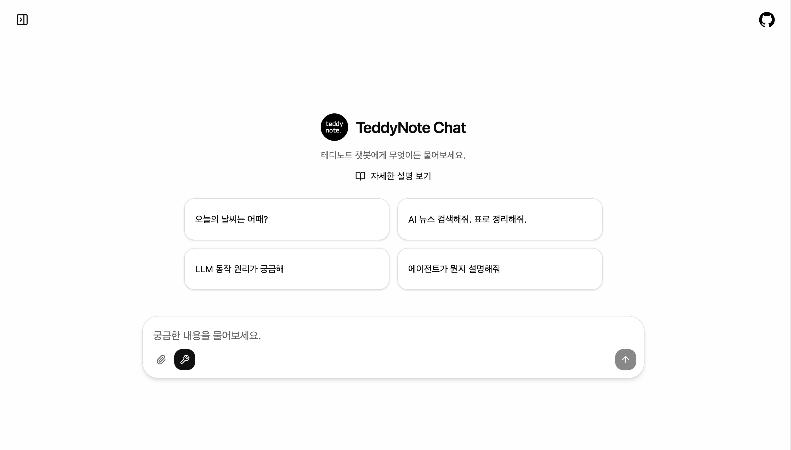

# Agent Chat UI



A Next.js-based chat interface for LangGraph agents. Provides extensive customization options through YAML-based configuration.

This is a modified project based on the original project [https://github.com/langchain-ai/agent-chat-ui](https://github.com/langchain-ai/agent-chat-ui).

## Overview

Agent Chat UI is a production-ready chat interface built with Next.js 15 that supports seamless interaction with LangGraph servers. It offers features including UI customization through YAML-based configuration, file uploads, conversation history management, and real-time streaming responses.

## Requirements

### Frontend (agent-chat-ui)
- Node.js 18.x or higher
- npm 9.x or higher (package manager)

### Backend (react-agent)
- Python 3.11 or higher
- uv (Python package manager)
- OpenAI API key (or other LLM API key)

## Installation

### 1. Clone the Repository

```bash
git clone https://github.com/teddylee777/agent-chat-ui.git
cd agent-chat-ui
```

### 2. Install Dependencies

```bash
npm install
```

### 3. Set Up LangGraph Backend Server

This chat UI works by connecting to a LangGraph backend server. To test in a local development environment, you must first set up the backend server.

#### Install Backend Server

```bash
# Clone backend repository
git clone https://github.com/teddylee777/react-agent
cd react-agent

# Set up environment variables
cp .env.example .env
# Edit the .env file to configure required API keys (OPENAI_API_KEY, etc.)

# Run LangGraph development server
uv run langgraph dev
```

The backend server will run at `http://localhost:2024`.

#### Configure Frontend Environment Variables

Return to the agent-chat-ui directory and create a `.env` file:

```bash
cd ../agent-chat-ui
cp .env.example .env
```

Set environment variables for local development:

```env
# Required: LangGraph API endpoint (for local development)
NEXT_PUBLIC_API_URL=http://localhost:2024

# Required: Assistant/Graph ID
NEXT_PUBLIC_ASSISTANT_ID=agent

# Optional: For production deployment
LANGGRAPH_API_URL=https://your-deployment.langgraph.app
LANGSMITH_API_KEY=lsv2_...
```

## Running the Application

### Development Mode

**Step 1: Run LangGraph Backend Server**

First, run the backend server (from the react-agent directory):

```bash
cd react-agent
uv run langgraph dev
```

The backend server will run at `http://localhost:2024`.

**Step 2: Run Frontend Development Server**

Open a new terminal window and start the frontend server:

```bash
cd agent-chat-ui
npm run dev
```

The frontend application will run at `http://localhost:3000`.

Now you can access `http://localhost:3000` in your browser to use the chat interface connected to the LangGraph backend.

### Production Build

Build and start the production server:

```bash
npm run build
npm start
```

### Other Commands

```bash
# Run linter
npm run lint

# Auto-fix linting issues
npm run lint:fix

# Format code with Prettier
npm run format

# Check code formatting
npm run format:check
```

## Configuration

### Configuration Files

The application is configured through YAML files in the `public` directory. These files control every aspect of the chat interface, from branding to UI behavior.

#### Main Configuration Files

1. **`public/chat-config.yaml`** - Overall chat interface configuration
   - Controls branding, buttons, tools, messages, threads, themes, UI behavior, etc.

2. **`public/chat-openers.yaml`** - Example conversation starter questions
   - List of questions displayed on the landing page (maximum 4 recommended)

### Configuration Options

#### 📄 chat-config.yaml

##### Branding Section

| Option | Type | Description | Example |
|--------|------|-------------|---------|
| `appName` | string | Application name displayed in header | `"Agent Chat"` |
| `logoPath` | string | Logo image path within public directory | `"/logo.png"` |
| `logoWidth` | number | Logo width in pixels | `32` |
| `logoHeight` | number | Logo height in pixels | `32` |

##### Buttons Section

| Option | Type | Description | Default |
|--------|------|-------------|---------|
| `enableFileUpload` | boolean | Show/hide file upload button | `true` |
| `fileUploadText` | string | File upload button text | `"Upload PDF or Image"` |
| `submitButtonText` | string | Submit button text | `"Send"` |
| `cancelButtonText` | string | Cancel button text | `"Cancel"` |

##### Tools Section

| Option | Type | Description | Default |
|--------|------|-------------|---------|
| `showToolCalls` | boolean | Display tool calls by default | `true` |
| `displayMode` | string | `"detailed"` or `"compact"` | `"detailed"` |
| `enabledTools` | string[] | List of tools to enable (all if empty) | `[]` |
| `disabledTools` | string[] | List of tools to disable | `[]` |

##### Messages Section

| Option | Type | Description | Default |
|--------|------|-------------|---------|
| `maxWidth` | number | Maximum message container width in pixels | `768` |
| `enableMarkdown` | boolean | Enable markdown rendering | `true` |
| `enableMath` | boolean | Enable LaTeX math rendering | `true` |
| `enableCodeHighlight` | boolean | Enable code syntax highlighting | `true` |
| `enableTables` | boolean | Enable table rendering | `true` |

##### Threads Section

| Option | Type | Description | Default |
|--------|------|-------------|---------|
| `showHistory` | boolean | Display conversation history sidebar | `false` |
| `enableDeletion` | boolean | Allow conversation deletion | `true` |
| `enableTitleEdit` | boolean | Allow conversation title editing | `true` |
| `autoGenerateTitles` | boolean | Auto-generate conversation titles | `true` |

##### Theme Section

| Option | Type | Values | Default |
|--------|------|--------|---------|
| `fontFamily` | string | `"sans"`, `"serif"`, `"mono"` | `"sans"` |
| `fontSize` | string | `"small"`, `"medium"`, `"large"` | `"medium"` |
| `colorScheme` | string | `"light"`, `"dark"`, `"auto"` | `"light"` |

##### UI Section

| Option | Type | Description | Default |
|--------|------|-------------|---------|
| `autoCollapseToolCalls` | boolean | Auto-collapse tool calls after completion | `true` |
| `chatWidth` | string | `"default"` (768px) or `"wide"` (1280px) | `"default"` |

##### Features Section

| Option | Type | Description | Default |
|--------|------|-------------|---------|
| `artifactViewer` | boolean | Enable Artifact viewer | `true` |
| `fileUploads` | boolean | Enable file uploads | `true` |
| `imagePreview` | boolean | Enable image preview | `true` |
| `pdfPreview` | boolean | Enable PDF preview | `true` |

#### 📄 chat-openers.yaml

Configure a list of example conversation starter questions. These are displayed as buttons on the landing page.

| Option | Type | Description |
|--------|------|-------------|
| `chatOpeners` | string[] | List of example questions (maximum 4 recommended) |

**Example:**
```yaml
chatOpeners:
  - "What's the weather today?"
  - "Search for AI news and organize it in a table."
  - "I'm curious about how LLMs work."
  - "What is an agent?"
```

### Configuration Examples

#### chat-config.yaml Example

```yaml
# Application branding
branding:
  appName: "TeddyNote Chat"
  logoPath: "/logo.png"
  logoWidth: 32
  logoHeight: 32

# Chat interface buttons
buttons:
  enableFileUpload: true
  fileUploadText: "Upload PDF or Image"
  submitButtonText: "Send"
  cancelButtonText: "Cancel"

# Tool display settings
tools:
  showToolCalls: true
  displayMode: "detailed"
  enabledTools: []
  disabledTools: []

# Message display settings
messages:
  maxWidth: 768
  enableMarkdown: true
  enableMath: true
  enableCodeHighlight: true
  enableTables: true

# Thread/Conversation settings
threads:
  showHistory: false
  enableDeletion: true
  enableTitleEdit: true
  autoGenerateTitles: true

# UI Theme settings
theme:
  fontFamily: "sans"
  fontSize: "medium"
  colorScheme: "light"

# UI Behavior settings
ui:
  autoCollapseToolCalls: true
  chatWidth: "default"

# Feature flags
features:
  artifactViewer: true
  fileUploads: true
  imagePreview: true
  pdfPreview: true
```

#### chat-openers.yaml Example

```yaml
chatOpeners:
  - "What's the weather today?"
  - "Search for AI news and organize it in a table."
  - "I'm curious about how LLMs work."
  - "What is an agent?"
  - "Find my notes."
  - "Tell me about LangGraph."
```

## Customizing User Guide

The complete user guide is located at `public/full-description.md`. This markdown file is displayed when users click the "View Detailed Description" button on the landing page.

### How to Update the Guide

1. Edit the `public/full-description.md` file
2. Use standard markdown syntax
3. Save the file and changes will be immediately reflected (no rebuild required)

### Recommended Guide Structure

- **Getting Started**: Basic usage instructions
- **Key Features**: Detailed feature descriptions
- **Settings**: Configuration options for end users
- **Tips and Tricks**: Advanced usage patterns
- **Troubleshooting**: Common issues and solutions

## File Upload Support

The application supports the following file formats:

- **Images**: JPEG, PNG, GIF, WebP
- **Documents**: PDF

How to upload files:
- Click the clip icon in the chat input box
- Drag and drop files into the chat interface
- Paste images from clipboard

## Production Deployment

### Production Environment Variables

```env
# Public variables (exposed to client)
NEXT_PUBLIC_ASSISTANT_ID=agent
NEXT_PUBLIC_API_URL=https://your-site.com/api

# Private variables (server-side only)
LANGGRAPH_API_URL=https://your-agent.langgraph.app
LANGSMITH_API_KEY=lsv2_...
```

### Deployment Platforms

The application can be deployed to the following platforms:

- **Vercel**: Recommended for Next.js applications
- **Netlify**: Full Next.js feature support
- **Docker**: Containerized deployment option
- **Traditional Hosting**: Any Node.js hosting provider

### Production Build

```bash
npm run build
```

This command creates an optimized production build in the `.next` directory.

## Architecture

### Tech Stack

- **Framework**: Next.js 15.x (React 19)
- **Styling**: Tailwind CSS 4.x
- **State Management**: React Hooks + nuqs (URL state)
- **UI Components**: Radix UI primitives
- **Markdown**: react-markdown (remark/rehype plugins)
- **Code Highlighting**: react-syntax-highlighter
- **Math Rendering**: KaTeX
- **API Integration**: LangGraph SDK

### Key Dependencies

- `@langchain/langgraph-sdk`: LangGraph client library
- `framer-motion`: Animation library
- `next-themes`: Theme management
- `sonner`: Toast notifications
- `js-yaml`: YAML configuration parsing

## Advanced Features

### Artifact Rendering

The chat interface can render artifacts (code, documents, visualizations) in a side panel. Artifacts are managed through LangGraph server response metadata.

### Tool Call Visibility

Users can toggle tool call visibility using the wrench icon in the chat input box. In hidden mode, only the final response is displayed for a clean interface.

### Auto-collapse Behavior

When `autoCollapseToolCalls` is enabled in configuration, tool call details automatically collapse after AI responses complete, keeping conversation history clean.

### Conversation Management

- Conversations are automatically saved with generated titles
- Users can rename or delete conversations
- Quick access to conversation history from the sidebar
- Thread state persists across browser sessions

## Troubleshooting

### Common Issues

**Issue**: Frontend application won't start
**Solution**: Check Node.js version (18+) and run `npm install` again

**Issue**: Cannot connect to LangGraph backend server
**Solution**:
- Verify `NEXT_PUBLIC_API_URL` environment variable is set to `http://localhost:2024`
- Confirm backend server is running (`cd react-agent && uv run langgraph dev`)
- Check for error messages in backend server terminal

**Issue**: Backend server won't run
**Solution**:
- Verify Python version (3.11+) and uv are installed
- Check that required API keys are configured in `react-agent/.env`
- Reinstall dependencies with `uv sync` command

**Issue**: File upload not working
**Solution**:
- Verify `buttons.enableFileUpload: true` or `features.fileUploads: true` in `public/chat-config.yaml`
- Hard refresh browser after configuration changes

**Issue**: Conversation starter examples not showing
**Solution**:
- Verify `public/chat-openers.yaml` file exists
- Check that `chatOpeners` array contains at least 1 question
- Hard refresh browser

**Issue**: Configuration changes not reflected
**Solution**:
- After modifying `public/chat-config.yaml` or `public/chat-openers.yaml`, hard refresh browser (Ctrl+Shift+R / Cmd+Shift+R) to clear cache
- Try restarting development server: `npm run dev`

## License

MIT License

Copyright (c) 2025 TeddyNote

Permission is hereby granted, free of charge, to any person obtaining a copy
of this software and associated documentation files (the "Software"), to deal
in the Software without restriction, including without limitation the rights
to use, copy, modify, merge, publish, distribute, sublicense, and/or sell
copies of the Software, and to permit persons to whom the Software is
furnished to do so, subject to the following conditions:

The above copyright notice and this permission notice shall be included in all
copies or substantial portions of the Software.

THE SOFTWARE IS PROVIDED "AS IS", WITHOUT WARRANTY OF ANY KIND, EXPRESS OR
IMPLIED, INCLUDING BUT NOT LIMITED TO THE WARRANTIES OF MERCHANTABILITY,
FITNESS FOR A PARTICULAR PURPOSE AND NONINFRINGEMENT. IN NO EVENT SHALL THE
AUTHORS OR COPYRIGHT HOLDERS BE LIABLE FOR ANY CLAIM, DAMAGES OR OTHER
LIABILITY, WHETHER IN AN ACTION OF CONTRACT, TORT OR OTHERWISE, ARISING FROM,
OUT OF OR IN CONNECTION WITH THE SOFTWARE OR THE USE OR OTHER DEALINGS IN THE
SOFTWARE.

## Resources

- YouTube Channel: [TeddyNote](https://youtube.com/c/teddynote)
- LangChain Documentation: [LangChain Documentation](https://docs.langchain.com/)
- Next.js Documentation: [nextjs.org/docs](https://nextjs.org/docs)

```